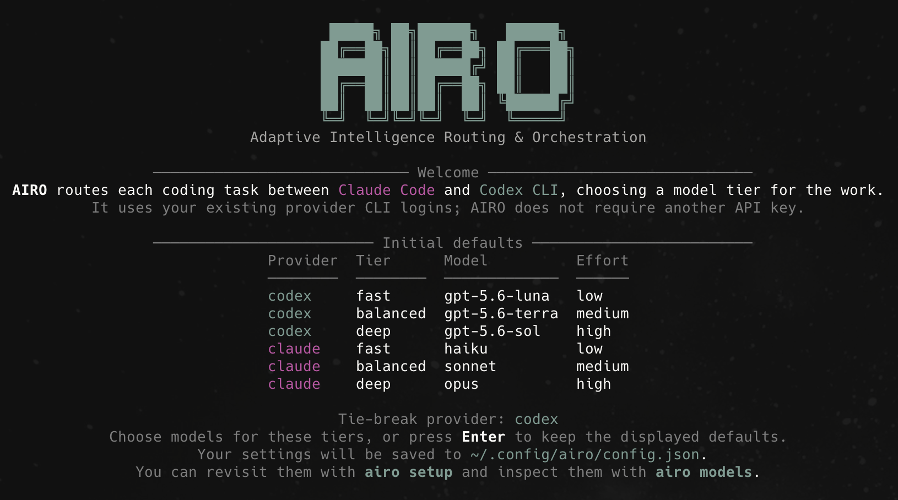
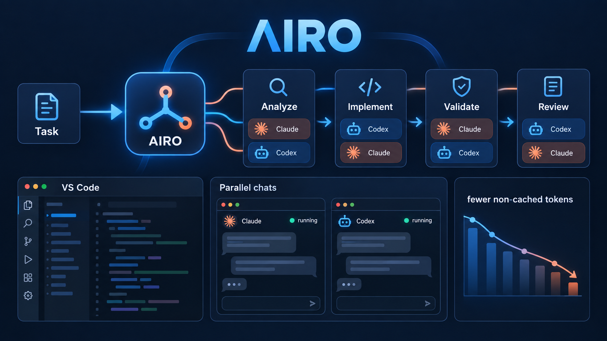

<h1 align="center">AIRO</h1>

<p align="center">
  
</p>

<p align="center">Adaptive Intelligence Routing &amp; Orchestration for Claude Code and Codex CLI.</p>

<p align="center">
  <a href="https://www.npmjs.com/package/airo-cli"></a>
  <a href="https://www.npmjs.com/package/airo-cli"></a>
  <a href="https://github.com/pablospaniard/airo-cli/actions/workflows/ci.yml"></a>
  <a href="https://github.com/pablospaniard/airo-cli/blob/main/LICENSE"></a>
  <a href="https://github.com/sponsors/pablospaniard"></a>
</p>

AIRO accepts a task, chooses the right provider and model tier, and can coordinate a multi-phase workflow across agents. It runs locally with your existing CLI logins—no separate model API keys or proxy service required.

```text
request → route → analyze → implement → test → review
                    Claude     Codex      Codex   Claude
```

## Why AIRO

- Routes each request independently using task signals, custom rules, and prior feedback.
- Maps work onto configurable `fast`, `balanced`, and `deep` model tiers.
- Hands complex tasks between Claude Code and Codex through a shared working tree.
- Preserves logical session context even when the provider changes between turns.
- Streams structured progress while keeping hidden reasoning private.
- Separates live progress from the provider's final result.
- Persists phase logs, final output, routing history, and user feedback locally.
- Inserts a recovery phase when a workflow fails or reports an unresolved problem.

<p align="center">
  
</p>

### Built for the way agent work actually happens

- **Seamless local integration.** Keep using the Claude Code and Codex CLI accounts you already have. AIRO runs in your repository, keeps the shared working tree, and needs no proxy, copied API keys, or separate hosted workspace.
- **Adaptive multi-model workflows.** AIRO can assign a different provider, model tier, and effort level to analysis, implementation, validation, and review—then add a recovery phase only when the evidence calls for it.
- **Measured token efficiency.** Fast or balanced models handle routine work while deep models are reserved for difficult phases. `airo usage` reports provider telemetry and a clearly labeled historical estimate against comparable default-model runs.
- **Sessions that survive context switches.** Continue a logical task even when the provider changes, restore past sessions, and keep concise task outcomes rather than exposing hidden reasoning.
- **A real VS Code workspace.** The included extension provides a sidebar chat, rich phase indicators, attachments, session history, and parallel editor chats. Open a new chat without stopping an active one; the history view marks running chats so you can jump back to them.

## Get started

1. Install Node.js 22 or newer, then install and sign in to Claude Code, Codex CLI, or both. AIRO uses those existing CLI logins—there are no AIRO API keys to create. The provider CLIs must be installed; AIRO invokes them as subprocesses and does not embed either provider.
2. Install AIRO and check your local setup:

   ```bash
   npm install --global airo-cli
   airo doctor
   ```

3. Launch AIRO. On the first interactive launch, choose models for the `fast`, `balanced`, and `deep` tiers (press Enter to keep the suggested defaults).

   ```bash
   airo
   ```

4. Enter a task, or run one directly from your shell:

   ```bash
   airo "review this PR for regressions"
   ```

### VS Code sidebar (preview)

The repository includes a VS Code extension in [`vscode-extension`](vscode-extension). Run `pnpm install` from the repository root, open the extension folder in VS Code, then press `F5` to launch an Extension Development Host. Its secondary-sidebar view is a stateful AIRO chat with visual workflow phases, provider-colored activity, attachments, and controls for models, accounts, usage, logs, diagnostics, and feedback. Use **New chat** to open an independent editor chat while another one runs; use **Previous chats** to restore or switch to saved chats, with active work clearly marked. Configure the executable, routing mode, provider, tier, and output detail under VS Code’s **AIRO** extension settings.

The extension invokes the AIRO CLI, so `airo-cli` must be installed (or the repository must be linked locally) in addition to any provider CLI. Provider CLIs do not need to be installed in a standard location, but every executable must be reachable either through `PATH` or an explicit command path. If VS Code cannot find `airo`, set **AIRO: Command** to the absolute path of the AIRO executable, such as `/Users/me/.local/bin/airo` or `/opt/homebrew/bin/airo`. The same setting is used by the sidebar and the **AIRO: Open Terminal** command.

AIRO can fall back to the available provider during adaptive runs when one CLI is missing. Run `airo setup` at any time to revisit the model choices.

## Common workflows

Open the interactive workspace:

```bash
airo
```

The workspace shows the active session, provider availability, routing preferences, and output mode. Type a task directly or use `/help` to discover commands. Tab completion is available for slash commands.

Start a session:

```bash
airo "review this PR for regressions"
```

Continue it with a newly routed follow-up:

```bash
airo --continue "fix the critical issue you found"
```

Force one agent or an adaptive workflow:

```bash
airo --single "rename this interface"
airo --adaptive "investigate and fix this intermittent failure"
```

### Workflow modes: automatic, adaptive, or single

`auto` is the default: AIRO reads the request and uses a multi-phase workflow for work that looks broad, risky, complex, review-oriented, or long; it keeps a simple request in one focused run. Choose `adaptive` to always plan phases, or `single` when you want one routed agent to own the task (see the `--single`/`--adaptive` examples above).

In an adaptive run, AIRO plans only the phases the task needs—typically **Analyze → Implement → Validate → Review**. Each phase is routed independently: for example, a balanced analysis can hand off to a deep implementation, followed by fast validation and an independent regression review. Preferences in a project’s `orchestration` configuration, explicit `--agent`/`--tier`/`--model` flags, and availability constraints are all respected. The VS Code **AIRO: Mode** setting exposes the same choices and displays the live phase and model route in the chat.

Preview the decision without running an agent:

```bash
airo --dry-run --explain "migrate this legacy module"
```

## Models and routing

AIRO scores each request for provider and complexity signals, applies matching configuration rules, and can incorporate feedback from similar prior work. It then maps the work to a `fast`, `balanced`, or `deep` tier. A tier is a default choice, not a restriction.

Out of the box, the automatic defaults are:

| Provider | Tier | Model | Effort |
| --- | --- | --- | --- |
| Claude Code | `fast` | `haiku` | `low` |
| Claude Code | `balanced` | `sonnet` | `medium` |
| Claude Code | `deep` | `opus` | `high` |
| Codex CLI | `fast` | `gpt-5.6-luna` | `low` |
| Codex CLI | `balanced` | `gpt-5.6-terra` | `medium` |
| Codex CLI | `deep` | `gpt-5.6-sol` | `xhigh` |

You can use any model your Claude Code or Codex CLI subscription makes available. AIRO does not maintain an allowlist. The setup wizard asks which models you have access to and lets you assign three of them to the automatic tiers; use it again whenever your access changes:

```bash
airo setup
airo models
```

For a one-off request, name a model explicitly. AIRO infers Claude for names such as `opus`, `sonnet`, `haiku`, or `claude-*`, and Codex for names such as `gpt-*` or `codex-*`. You can also pin the provider yourself:

```bash
airo --model opus "review this authentication change"
airo --agent claude --model sonnet "explain this failing test"
airo --agent codex --model gpt-6-astra "review this PR for regressions"
```

The `--model` value is passed to the selected provider CLI, so it must be a model that CLI accepts for your account. If an explicit model name is unfamiliar to AIRO, include `--agent claude` or `--agent codex`.

### How AIRO detects your access

AIRO uses the Claude Code and Codex CLI installations already on your machine. By default it invokes the commands `claude` and `codex`, so they must be available on the `PATH` inherited by AIRO. AIRO does not scan common install directories or discover arbitrary executable locations automatically.

If Claude Code or Codex was installed somewhere else, set that provider's command to an absolute executable path in `.airo.json` (project-specific) or `~/.config/airo/config.json` (global):

```json
{
  "claude": { "command": "/Users/me/tools/claude" },
  "codex": { "command": "/opt/codex/bin/codex" }
}
```

For example, a project using custom locations can contain:

```json
{
  "claude": { "command": "/Volumes/Tools/claude-code/bin/claude" },
  "codex": { "command": "/Applications/Codex/bin/codex" }
}
```

You can also put the provider directories on `PATH`. This is usually easiest for terminal use, but GUI-launched VS Code processes may not load the same shell startup files. In that case, configure absolute provider paths in `.airo.json` or the global config, and configure the absolute AIRO CLI path separately in **AIRO: Command**. AIRO does not scan arbitrary directories automatically. The configured provider command may be a wrapper script, as long as it accepts the normal Claude Code or Codex CLI arguments.

AIRO asks each CLI for its login status and authentication method; that can identify whether the CLI is signed in, but providers may intentionally not expose your email address or a complete list of subscription entitlements. AIRO never reads or decodes your stored credentials.

Use these commands to see what AIRO can see:

```bash
airo doctor
airo account
```

`airo account` also reports each provider's configured comparison default. AIRO looks for that default in its own configuration first, then in `ANTHROPIC_MODEL` or Claude settings for Claude Code, and in Codex's `config.toml` for Codex. This default is used for the `airo usage` comparison; it does not limit which model you can run. If it cannot be found automatically, set it in `airo setup` or as `defaultModel` in that provider's AIRO configuration.

## Sessions and interactive chat

### Start work and continue it

Every task runs in an AIRO session. A session keeps a concise record of earlier outcomes so a follow-up has useful context, even if AIRO selects a different provider or model. It does not share the hidden conversation history of Claude or Codex between runs.

```bash
airo "review this PR for regressions"          # starts a session
airo --continue "fix the critical issue"       # continues the active repository session
airo --session <session-id> "add tests for that fix"
```

Manage saved sessions with:

```bash
airo session                                  # show the active session
airo sessions                                 # list repository sessions
airo session new "investigate checkout flow"  # start and activate a fresh session
airo session clear                            # clear the active repository session
```

### Use the interactive workspace

Run `airo` (or `airo chat`) to stay in a terminal workspace and send several tasks without retyping the command. The choices below last for that running workspace; use `airo setup` or configuration to make persistent model changes.

```text
/mode auto|adaptive|single
/agent auto|claude|codex
/tier auto|fast|balanced|deep
/log compact|live|verbose
/status
/new [title]
/models
/sessions
/clear
/exit
```

Type `/help` in the workspace for the complete command list. Tab completion is available for slash commands.

### Attach a file or answer a question

To share a local file from the terminal, save it on disk, then use `/attach /path/to/file` before entering your task. You can also drag a supported file from an IDE such as VS Code directly into the running AIRO terminal; press Enter and AIRO will attach it and ask the provider to inspect it. Quoted paths and paths containing spaces are supported. AIRO passes the local path to the provider and clears the attachment after the next task. The file stays on disk; AIRO does not upload it itself. Supported extensions are PNG, JPEG, GIF, WebP, BMP, TIFF, PDF, Markdown (`.md`/`.markdown`), and JSON.

If an agent needs a blocking decision, it can emit `AIROUTE_QUESTION:`. AIRO asks for input and resumes the same phase, with up to four clarification rounds per phase.

For Claude runs, answering exactly `approve` or `approved` resumes the same model and phase with `bypassPermissions` for that continuation attempt. Other answers preserve the configured permission mode.

The test suite enforces at least 95% line and function coverage. Run it with `pnpm test` or `pnpm run test:coverage`.

## Logs and feedback

Choose how much progress appears in the terminal:

```bash
airo --log compact "task"
airo --log live "task"
airo --log verbose "task"
```

- `compact` shows router and phase status.
- `live` adds streamed agent output and is the default.
- `verbose` also shows stderr and command metadata.

Inspect persisted runs:

```bash
airo logs
airo logs <run-id>
airo logs --follow <run-id>
airo history 20
airo usage 20
```

Teach the router from a completed run:

```bash
airo feedback good
airo feedback bad "used more reasoning than necessary"
```

After a completed run, AIRO continues straight to the next prompt and shows an optional feedback command:

```text
ⓘ optional feedback: /feedback good  |  /feedback bad
```

Use `good` to record positive feedback or `bad` to record negative feedback. Disable `history.learningEnabled` to turn off feedback-based routing adjustments.

Each persisted run stores its combined log, individual phase logs, structured event streams, and a clean `final-output.txt` containing only the provider's terminal response. Set `logging.persist` to `false` to keep the terminal stream without writing run files.

`airo usage` reports provider-supplied token telemetry. Its savings percentage compares non-cached tokens against observed, comparable successful AIRO runs that used the locally configured default model for that provider. The command labels the result as a historical estimate and withholds it until enough baseline data exists; it does not infer token savings from model names.

## Configuration

The setup wizard writes global configuration to:

```text
~/.config/airo/config.json
```

Create a project-specific configuration with:

```bash
airo config init
```

This creates `.airo.json` in the current directory. Project configuration takes precedence over global configuration. See [`airo.config.example.json`](airo.config.example.json) for all available settings.

On the first command after upgrading, AIRO copies legacy global configuration and data into `~/.config/airo/` and `~/.local/share/airo/`. The old files remain untouched as a rollback path. Project-level `.ai-router.json` files continue to be discovered.

Claude runs use `permissionMode: "acceptEdits"` by default so headless implementation tasks can edit the working tree. Change it to `auto`, `manual`, `dontAsk`, or `plan` in configuration when a more restrictive mode is appropriate. The legacy `allowedModels` setting is accepted for configuration compatibility but no longer restricts model access.

## Troubleshooting

| Problem | What to do |
| --- | --- |
| AIRO says a provider is unavailable | Run `airo doctor`. Install the missing `claude` or `codex` CLI, put it on `PATH`, or set `claude.command`/`codex.command` to its absolute path in AIRO configuration, then sign in with that CLI. |
| The VS Code sidebar cannot start AIRO | Install or link `airo-cli`, then set **AIRO: Command** to the absolute `airo` executable path if `airo` is not on VS Code’s `PATH`. |
| AIRO cannot tell whether I am signed in | Run `airo account`, then sign in or refresh the login using the provider's own CLI. Provider CLIs may not reveal an email address or subscription name; that is expected. |
| My model is rejected | Confirm the model is available to your current provider subscription, then run it with `--agent claude` or `--agent codex` and `--model <model>`. Use `airo setup` to update automatic tier defaults. |
| The comparison default is missing | Run `airo setup` and enter the provider's usual model when prompted, or set that provider's `defaultModel` in AIRO configuration. This only affects `airo usage` comparisons. |
| Node will not run AIRO | Check `node --version`; AIRO requires Node.js 22 or newer. Upgrade Node, reinstall AIRO, and run `airo doctor` again. |
| Claude asks for permission or cannot edit | Review the Claude `permissionMode` in AIRO configuration. The default is `acceptEdits`; choose `manual` or `plan` when you want stricter control. |

## CLI command reference

| Command | What it does |
| --- | --- |
| `airo` / `airo chat` | Open the interactive workspace. |
| `airo "task"` | Create a session and route a task automatically. |
| `airo --continue "task"` | Route a follow-up using the active repository session. |
| `airo --session <id> "task"` | Run a task in a specific saved session. |
| `airo --single "task"` | Run one selected or automatically routed agent. |
| `airo --adaptive "task"` | Force the multi-phase workflow. |
| `airo --dry-run --explain "task"` | Show the routing decision without running an agent. |
| `airo --agent <claude\|codex> --tier <fast\|balanced\|deep> "task"` | Pin a provider and model tier. |
| `airo --model <model> --effort <level> "task"` | Override the chosen model and reasoning effort. |
| `airo --log <compact\|live\|verbose> "task"` | Control terminal progress detail. |
| `airo setup` | Configure automatic model tiers. |
| `airo models` | Print the active provider/model mapping. |
| `airo account` | Show provider login status and detected defaults. |
| `airo doctor` | Check provider commands and storage locations. |
| `airo config init` | Create a project-local `.airo.json`. |
| `airo session` / `airo sessions` | Show the active session or list repository sessions. |
| `airo session new ["task"]` | Start and activate a fresh session. |
| `airo session clear` | Clear the active repository session. |
| `airo logs [run-id]` / `airo logs --follow <run-id>` | List, print, or follow persisted run logs. |
| `airo history [limit]` | Show recent routing history. |
| `airo usage [limit]` | Show provider-reported tokens and the historical default-model comparison. |
| `airo feedback <good\|bad> [note]` | Teach the router from the latest completed run. |
| `airo --help` / `airo --version` | Show help or the installed version. |

Set `NO_COLOR=1` to disable ANSI colors.

## Local usage

To run the latest source locally, [clone the AIRO repository](https://github.com/pablospaniard/airo-cli), install its dependencies, build it, and link the command:

```bash
git clone https://github.com/pablospaniard/airo-cli.git
cd airo-cli
corepack enable
pnpm install
pnpm run build
pnpm link --global
airo doctor
```

After linking, `airo` uses the source checkout while you work on it. Run `pnpm test` before submitting changes. To remove the local link later, run `pnpm unlink --global airo-cli`.

## Development

The repository pins its pnpm version through `package.json`. Enable Corepack once so the `pnpm` command uses that version:

```bash
corepack enable
pnpm install
pnpm test
```

`pnpm test` compiles the TypeScript sources and runs the Node.js test suite. Generated files under `dist/` are intentionally ignored.

Install the repository pre-push hook once per checkout to run the full validation suite before pushing:

```bash
pnpm run hooks:install
```

The hook runs `pnpm run validate`, which checks formatting, linting, types, and tests.

## Compatibility aliases

`ai-router`, `airoute`, and `ai-route` remain available as command aliases for existing users. New documentation and integrations should use `airo`.
